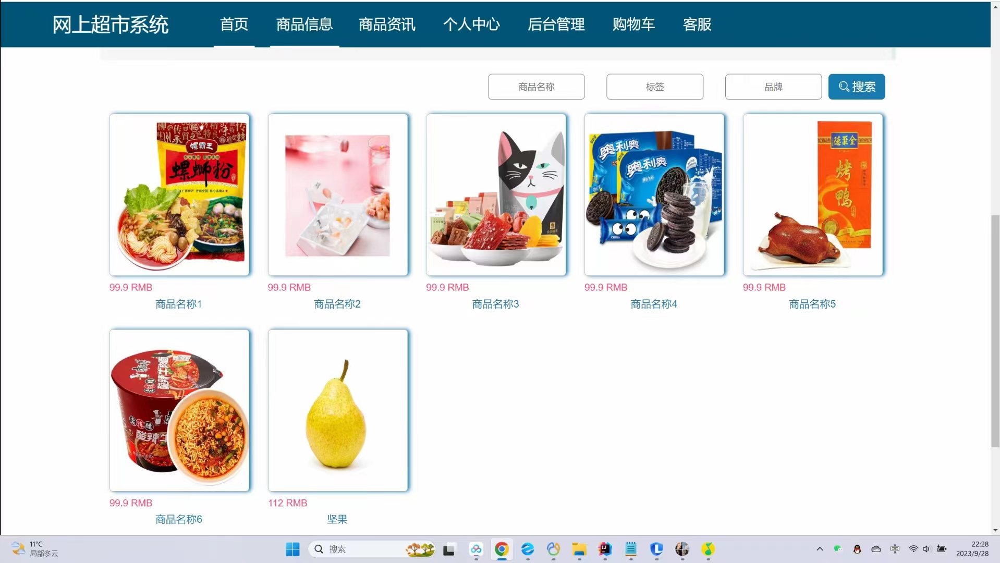
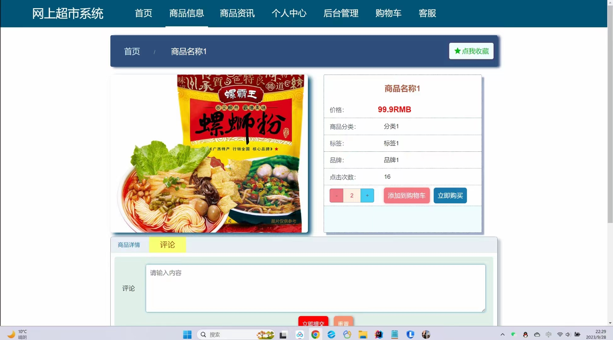
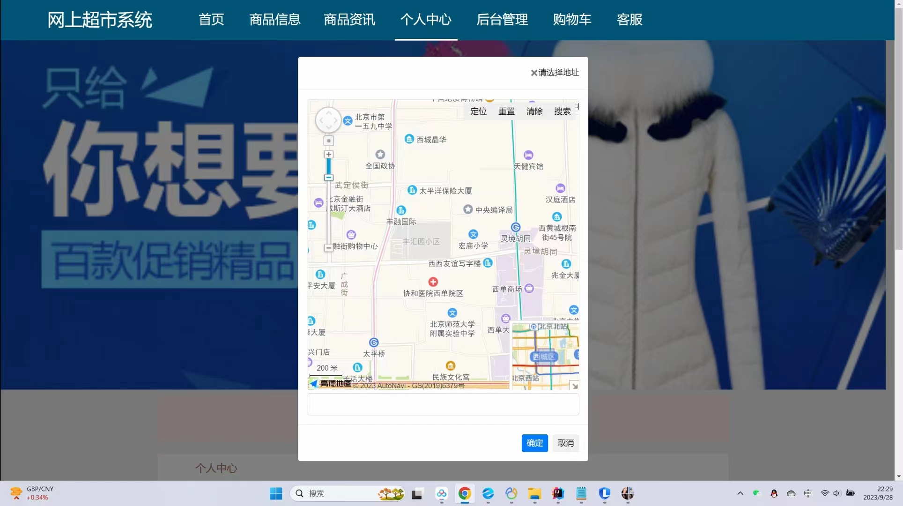
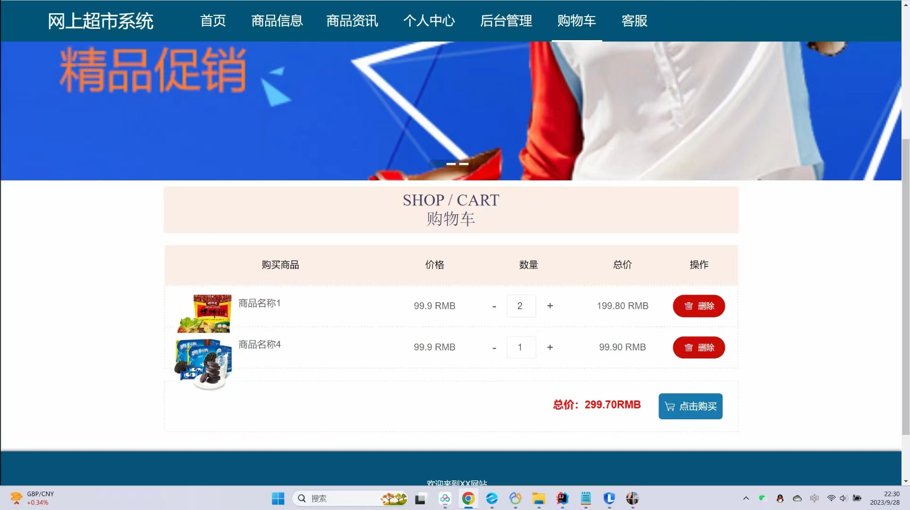
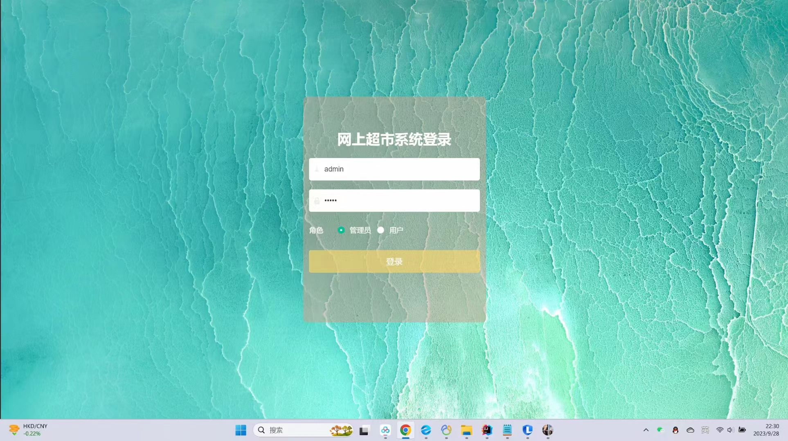
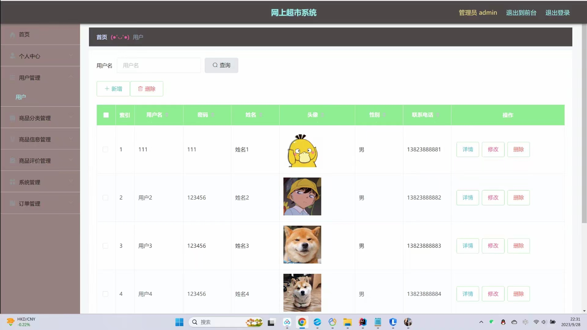
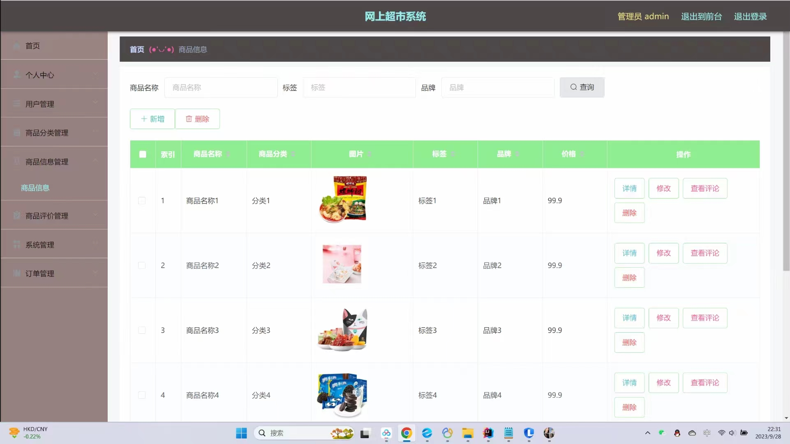
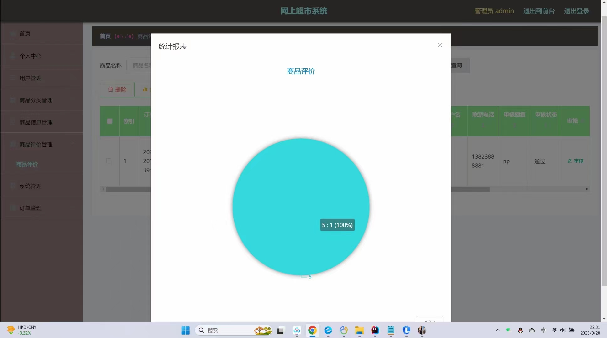

# 基于SpringBoot网上超市设计与实现

#### 介绍
基于SpringBoot+vue的网上超市系统设计与实现；本项目包含：源码+数据库sql+开题报告+论文+说明文档 
本项目可以用于毕业设计，白嫖勿扰！ 全网毕业设计项目这里都有 更多项目源码可以私信联系：微信 -- 13283346760

#### 主要功能
##### 前台登录：
注册用户：用户名、密码、姓名、联系电话
用户：
①首页、商品信息推荐、商品资讯、查看更多
②商品信息、商品详情、评论、点我收藏、添加购物车、立即购买
③个人中心、余额、点我充值、更新信息、我的订单、我的地址、我的收藏、购物车、客服等

##### 后台登录：
用户：
①首页、个人中心、修改密码、个人信息
②商品评价、我的收藏、订单管理
管理员：
①首页、个人中心、修改密码、个人信息
②用户管理、商品分类管理、商品信息管理、商品评价管理、系统管理、轮播图管理、商品资讯、客服管理、订单管理等

#### 软件架构
软件架构说明

#### 安装教程
需要安装的软件
开发工具： idea
数据库：Mysql 5或8
服务器：Tomcat（版本随意）
后端框架：springboot
前端框架：vue、elementui、layui

#### 使用说明
1. 创建数据库wangshangchaoshi，再运行数据库文件夹里的sql脚本，创建相应表
2. 修改application.yml中与Mysql数据库相关的信息
3. 配置maven依赖，jdk版本
4. 启动项目

#### 运行截图

#### 获取源码
白嫖勿扰

VX：13283346760

QQ：985089028